# WhisperFrame 🎨🎙️

**Ambient audio → AI art generation → Live display**

WhisperFrame is an intelligent photo frame that listens to conversations in a room, distills the mood and topics being discussed, and continuously generates and displays AI art that reflects those conversations. It's a living, breathing piece of ambient technology that turns your space into an ever-evolving art gallery.

## 🎯 What It Does

WhisperFrame creates a feedback loop between human conversation and AI creativity:

1. **Listens** to ambient conversations using a microphone (USB microphone or 4-microphone array)
2. **Transcribes** speech snippets using OpenAI Whisper
3. **Summarizes** conversation themes using GPT-4.1
4. **Generates** artistic prompts and creates images via a custom AI endpoint
5. **Displays** the resulting artwork on a connected screen
6. **Repeats** the cycle every 20 audio snippets (approximately 5-6 minutes) during active conversation

The result is a dynamic art piece that reflects the energy, topics, and mood of your space in real-time.

## 🔄 How It Works

### System Architecture

```mermaid
graph TB
    subgraph "Audio Processing"
        A[🎤 Microphone<br/>USB or ReSpeaker HAT] --> B[WebRTC VAD<br/>Voice Detection]
        B --> C[15s Audio Chunks<br/>When Speech Detected]
    end
    
    C --> D[OpenAI Whisper<br/>Speech-to-Text]
    D --> E[Rolling Buffer<br/>~120 lines max]
    E --> F[GPT-4.1<br/>Conversation Summary]
    F --> G[GPT-4.1<br/>Art Prompt Generation]
    
    subgraph "AI Processing Pipeline"
        G --> H[Custom AI Endpoint<br/>Image Generation]
    end
    
    subgraph "Storage & Display"
        H --> I[Azure Blob Storage<br/>Image Persistence]
        I --> J[Local JSON Database<br/>Metadata & URLs]
        J --> K[Flask Web Server<br/>Display Interface]
        K --> L[HDMI Display<br/>Picture Frame]
    end
    
    subgraph "Feedback & Status"
        M[LED Ring<br/>Progress Indicator<br/>(Optional)] --> A
        K --> N[WebSocket Updates<br/>Real-time Display]
        K --> O[Adafruit IO<br/>Live Website & External Access]
    end
    
    style A fill:#e1f5fe
    style F fill:#f3e5f5
    style H fill:#fff3e0
    style K fill:#e8f5e8
```

### Detailed Processing Flow

```mermaid
flowchart TD
    A[🎤 Continuous Audio Monitoring] --> B{WebRTC VAD<br/>Speech Detected?}
    B -->|Silence| A
    B -->|Speech| C[📹 Record 15s Audio Chunk]
    C --> D[🗣️ OpenAI Whisper Transcription<br/>Model: gpt-4o-transcribe]
    D --> E[📝 Append to Rolling Buffer<br/>Max 120 lines]
    E --> F[📊 Increment Counter<br/>Target: 20 chunks]
    F --> G{Counter >= 20?}
    G -->|No| H[💡 Update LED Progress<br/>Show completion %]
    H --> A
    G -->|Yes| I[🧠 GPT-4.1 Analysis<br/>Last 20 transcript lines]
    I --> J[🎨 GPT-4.1 Prompt Generation<br/>Art description + style]
    J --> K[🖼️ Custom AI Image Generation<br/>via Custom Endpoint]
    K --> L{Generation<br/>Successful?}
    L -->|Blocked by Safety| M[🔄 GPT-4.1 Prompt Rewrite<br/>Safety compliance]
    M --> K
    L -->|Failed| N[❌ Log Error & Continue]
    L -->|Success| O[💾 Save to Azure Blob Storage<br/>via Custom Endpoint]
    O --> P[📄 Update Local Database<br/>prompts.json]
    P --> Q[🌐 Notify Web Display<br/>WebSocket broadcast]
    Q --> R[🔄 Reset Counter to 0]
    R --> A
    
    style A fill:#e1f5fe
    style I fill:#f3e5f5
    style K fill:#fff3e0
    style Q fill:#e8f5e8
```



### Processing Pipeline Details

| Stage | Component | Input | Output | Duration | Notes |
|-------|-----------|-------|--------|----------|-------|
| **Audio Capture** | `recording.py` | Ambient sound | 15s WAV chunks | Continuous | Only when speech detected |
| **Voice Detection** | WebRTC VAD | Audio frames | Speech/silence flags | Real-time | Mode 3 (most aggressive) |
| **Transcription** | OpenAI Whisper | Audio chunks | Text snippets | ~2-3s | Background thread with timeout |
| **Buffering** | `main.py` | Text snippets | Rolling buffer | Continuous | Max 120 lines, uses last 20 for art |
| **Summarization** | GPT-4.1 | 20 transcript lines | Conversation themes | ~5-10s | Identifies dominant topics |
| **Prompt Creation** | GPT-4.1 | Themes + examples | Art description | ~3-5s | Includes style and medium |
| **Image Generation** | Custom AI Endpoint | Art prompt | 1536×1024 image | ~30-60s | Custom endpoint + Azure storage |
| **Display Update** | Flask + WebSocket | Image metadata | Live display | Instant | Real-time browser updates |

## 🏗️ Repository Structure

```
whisperframe2/
├── 📁 src/                    # Main application code
│   ├── 🐍 main.py            # Orchestrator & main loop
│   ├── 🎙️ recording.py       # Audio capture & transcription
│   ├── 🎨 generate.py        # Prompt creation & image generation
│   ├── 🖥️ view.py            # Flask web server & display logic
│   ├── 💡 leds.py            # LED progress indicators
│   ├── ⚙️ settings.py        # Configuration & API keys
│   ├── 🖼️ image_generators.py # Custom AI endpoint interface
│   ├── 📁 prompts/           # GPT-4 system prompts
│   │   ├── system.txt        # Main image generation prompt
│   │   ├── name_system.txt   # Artist name generation prompt
│   │   ├── example_1.txt     # Example conversation
│   │   └── example_result_1.txt # Example result
│   ├── 📁 templates/         # HTML templates
│   │   └── index.html        # Main display template
│   ├── 📁 static/            # CSS & JavaScript
│   │   ├── style.css         # Display styling
│   │   └── script.js         # WebSocket & image handling
│   ├── 📁 db/                # Data storage (created at runtime)
│   │   ├── 📄 transcript.txt # Rolling conversation buffer
│   │   └── 📄 prompts.json   # Generated images database
│   └── 📋 README.md          # Setup & configuration guide
├── 📁 4mics_hat/             # ReSpeaker HAT drivers & examples
├── 📁 seeed-voicecard/       # Kernel audio drivers
├── 📁 sign_src/              # External signage code
└── 📋 README.md              # This file - system overview
```

### Key Components Explained

#### Core Processing (`main.py`)
The heart of the system that orchestrates the conversation → art pipeline. Manages the 20-snippet counter and coordinates between all other components. Uses PvRecorder for audio input and WebRTC VAD for voice activity detection.

#### Audio Pipeline (`recording.py`)
- **WebRTC VAD**: Voice activity detection that only processes audio when people are actually speaking (mode 3 - most aggressive)
- **Chunking**: Creates 15-second audio segments with natural conversation flow
- **Transcription**: Calls OpenAI Whisper API (gpt-4o-transcribe model) with timeout protection and error handling
- **Buffer Management**: Maintains rolling transcript with maximum 120 lines

#### AI Generation (`generate.py`)
- **Theme Extraction**: GPT-4.1 analyzes the last 20 transcript lines to identify dominant conversation topics
- **Prompt Engineering**: Converts themes into vivid artistic descriptions using carefully crafted system prompts
- **Safety Handling**: Automatically rewrites prompts that violate content policies (max 1 rewrite attempt)
- **Artist Naming**: Generates creative artist names for each piece using GPT-4.1

#### Custom AI Endpoint (`image_generators.py`)
The system uses a custom endpoint that wraps OpenAI's `gpt-image-1` model. This endpoint:
- **Generates Images**: Uses OpenAI's `gpt-image-1` model for high-quality image generation
- **Handles Storage**: Automatically saves images to Azure Blob Storage, eliminating local storage concerns on the Raspberry Pi
- **Provides URLs**: Returns persistent URLs for images with authentication
- **Manages Retries**: Implements exponential backoff for network errors and 500 status codes
- **Safety Filtering**: Handles moderation blocks with appropriate error handling

#### Display System (`view.py`)
- **Smart Display Logic**: Shows newest images when conversation is active (last 30 minutes), random historical images during quiet periods
- **Night Mode**: Goes dark between midnight and 7 AM
- **Live Updates**: WebSocket connections provide real-time image updates without page refreshes
- **External Integration**: Publishes to Adafruit IO for live website access, allowing others to see image details remotely
- **Random Selection**: Uses time-based seeding for consistent 5-minute random image intervals

#### Hardware Interface (`leds.py`)
Controls LED indicators to show processing progress and system status. This is completely optional - the system supports both real LED hardware (ReSpeaker HAT) and a dummy implementation when LEDs are not available or disabled.

## 🛠️ Hardware Requirements

| Component | Purpose | Notes |
|-----------|---------|-------|
| **Raspberry Pi 4** (4GB+) | Main computer | Runs all processing |
| **Microphone** | Audio capture | USB microphone or ReSpeaker 4-Mic HAT |
| **HDMI Display** (10-15") | Image display | Mounted in picture frame |
| **MicroSD Card** (32GB+) | Storage | For OS and image cache |
| **USB-C Power Supply** | Power | Standard Pi 4 PSU |
| **LED Ring** (Optional) | Progress indicator | Only with ReSpeaker HAT |

### Microphone Options

**USB Microphone** (Recommended for beginners)
- Any standard USB microphone works perfectly
- Plug-and-play setup with no driver installation required
- Ideal for single-room installations
- Typically appears as device 0 or 1

**ReSpeaker 4-Mic HAT** (Advanced option)
- Far-field microphone array with better pickup range
- Built-in LED ring for visual feedback
- Requires driver installation and more complex setup
- Better for larger rooms or noisy environments

## 🎨 How the AI Works

### Conversation Processing
- **Voice Activity Detection**: Uses WebRTC VAD (mode 3) to only process audio when people are actually speaking, saving API costs and improving relevance
- **Rolling Buffer**: Maintains last 120 transcript lines for storage, but uses only the most recent 20 lines for art generation
- **Smart Chunking**: 15-second audio segments capture natural conversation flow without cutting off words

### Art Generation Pipeline
1. **Theme Extraction**: GPT-4.1 analyzes the last 20 transcript lines to identify the dominant conversation topic
2. **Prompt Engineering**: Converts themes into vivid, artistic descriptions using custom system prompts that specify subject, medium, style, and details
3. **Artist Naming**: Generates creative (fictional) artist names for each piece to add personality
4. **Safety Filtering**: Automatically detects and rewrites prompts that violate content policies (maximum 1 rewrite attempt)
5. **Image Creation**: Uses OpenAI's `gpt-image-1` model via custom endpoint wrapper for high-quality, consistent results with automatic Azure storage

### Display Intelligence
- **Recent Priority**: Shows newest images when conversation is active (last 30 minutes)
- **Random Fallback**: Displays random historical images during quiet periods using time-based seeding
- **Night Mode**: Automatically goes dark between midnight and 7 AM
- **Live Updates**: WebSocket connections provide instant display updates when new images are generated

## 🎯 Use Cases

- **Living Room Art**: Dynamic artwork that reflects family conversations and creates talking points
- **Office Ambiance**: Meeting room displays that visualize discussion themes and team dynamics
- **Event Documentation**: Conferences or gatherings with visual conversation summaries
- **Creative Spaces**: Studios where the environment responds to and inspires creative discussions
- **Social Experiments**: Exploring the intersection of AI, art, and human interaction in real-time

## 🔧 Advanced Configuration

The system is highly configurable through environment variables and prompt engineering:

- **Sensitivity Tuning**: Adjust WebRTC VAD mode (0-3) in `recording.py` for different noise environments
- **Style Presets**: Modify GPT-4.1 prompts in `src/prompts/` for different artistic styles
- **Timing Control**: Change generation frequency by adjusting the 20-snippet counter in `main.py`
- **Display Options**: Customize web interface appearance and behavior in `src/templates/` and `src/static/`
- **Buffer Management**: Adjust `MAX_TRANSCRIPT_LINES` in `recording.py` for longer/shorter conversation memory
- **Art Generation Window**: Change the `num_of_lines` parameter in `generate.py` to use more or fewer transcript lines

## 🚀 Getting Started

For detailed setup instructions, hardware configuration, and troubleshooting, see the [Setup Guide](src/README.md).

---

*WhisperFrame transforms any space into an intelligent, responsive art installation that bridges human conversation and AI creativity, creating a unique fusion of technology and artistic expression.*
